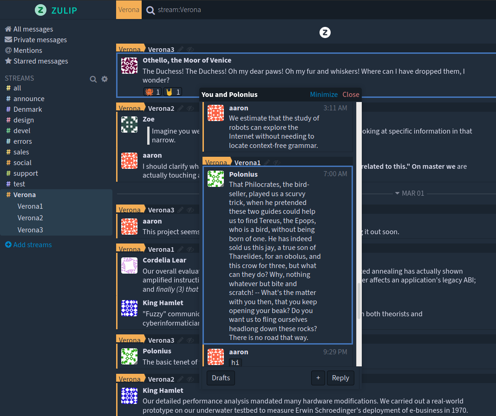
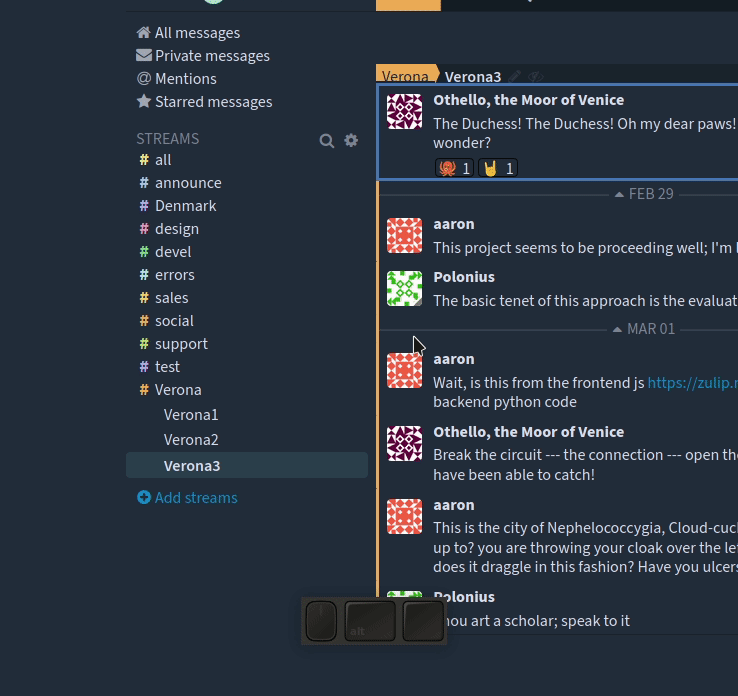

# Zulip Floating Windows

Enables floating narrows in Zulip, so that you can chat in multiple places at the same time without losing your location, in the same tab.

## Features

* Supports multiple floating windows.
* Floating windows are movable.
* Minimize/ maximize the windows to save space.
* Window themed according to Zulip dark mode setting.

## How to Use

`Alt + Click` on any narrow header to open a floating window. See example 'narrow title' below.

In the above example, you `Alt+click` anywhere in `general > Custom Source Code Zulip` header to open a floating window.

## Installation

### Firefox

* **[Pending Review - Use other steps for now]** [Install](https://addons.mozilla.org/en-GB/firefox/addon/zulip-floating-windows/) from the Firefox addons website.

* Or install manually-
  * [Download](releases/firefox/extension.zip) the extension file for Firefox from the [releases/firefox](releases/firefox/extension.zip) folder.
  * Open `about:debugging#/runtime/this-firefox` in Firefox.
  * Choose "Load temporary add on" and then select the downloaded zip file to load the extension.

### Chrome

* [Download]((releases/chrome/zulip-extension.crx) the extension file for Chrome from the [releases/chrome](releases/chrome/zulip-extension.crx) folder.
* Open `chrome://extensions/` and enable developer mode from the top right.
* Drag and drop the downloaded `zulip-extension.crx` file into the window to install the extension.

## About

This unofficial extension was created by [agrawal-d](https://github.com/agrawal-d) for fun, and is in no way affiliated with Zulip.

## License

This extension is MIT Licensed.
